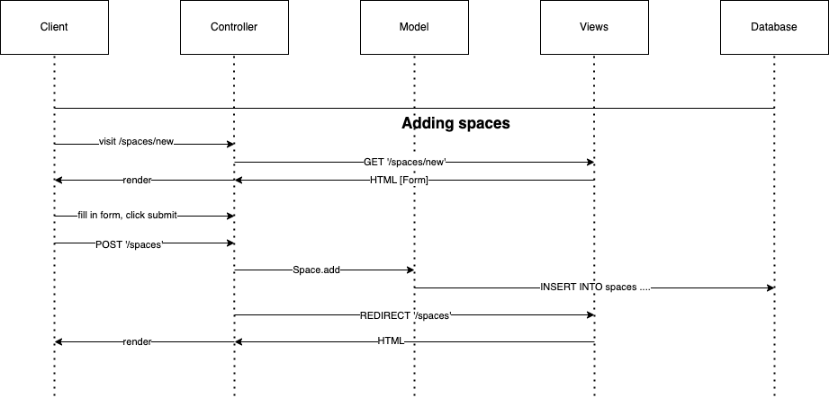
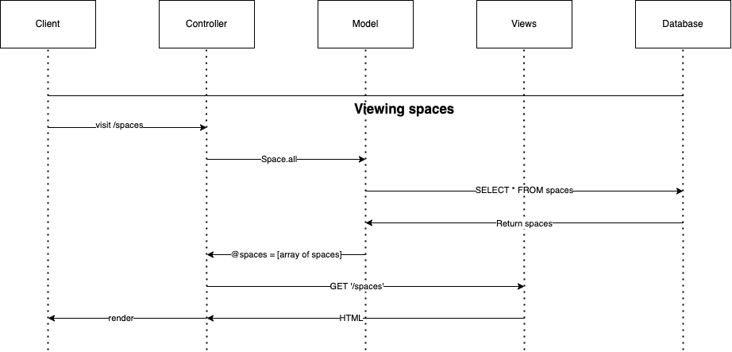
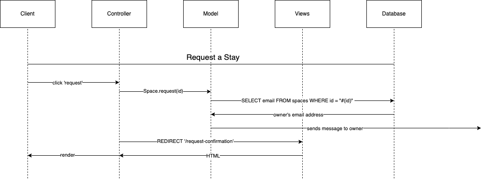

# README 

## User Stories 

As an owner I want to be able to list a space with a name, description and price.

As a booker I want to be able to request to hire a space for one night.

As  the owner and booker I want to be able to sign up.

As an owner I want to be able to offer my space on a range of dates.

As an owner I want to be able to confirm bookings for my space.

As a booker I only want to see available spaces.

Bookers are able to view spaces until a booking is confirmed by the owner.

## Domain Models

## Set up

To setup the database:

* Connect to psql
* Create the database using the psql command `CREATE DATABASE ducks_bnb;`
* Connect to the database using the psql command `\c ducks_bnb`;
* create a table using the create spaces table db file. 

To setup the test database:

* Connect to psql
* Create the database using the psql command `CREATE DATABASE ducks_bnb_test;`
* Connect to the database using the psql command `\c ducks_bnb_test`;
* create a table using the create spaces table db file. 