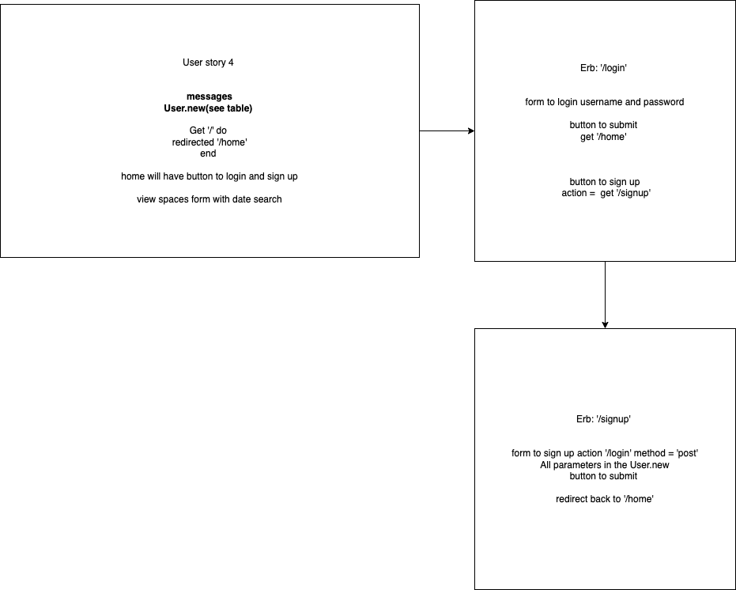
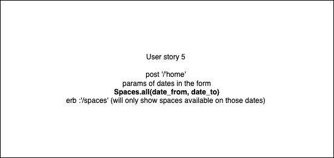
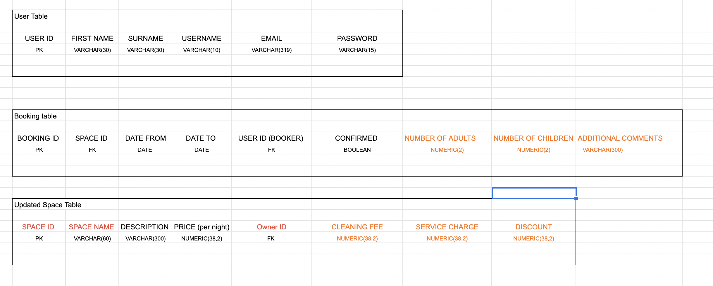

# DUCKSBNB APP
  __        
<(o )___
 ( ._> /
  `---'

## User Stories

```
As a person looking for a space
So that I can choose a space
I want to be able to see all available spaces.
```

```
As a space owner
So that I can offer my space for hire
I want to be able to list a space with a name, description and price.
```

```
As a person looking for a space
So that I can book a space
I want to be able to request to hire a space for one night.
```

```
As a user of DucksBnB
So that I can use the DucksBnB features
I want to be able to sign up.
```

```
As a space owner
So that I can communicate space availability
I want to be able to offer my space on a range of dates.
```

```
As a space owner
So that I can regulate who books my space and on what dates
I want to be able to confirm bookings for my space.
```

```
As a space owner
So that other users can request my spaces
I would like my space to show as available until a booking is confirmed.
```

## Domain Models
### Adding spaces


### Viewing spaces


### Requesting a stay


### Being able to sign up or login


### Only able to see available spaces


## How to use
### To set up the project

Clone this repository and then run:
```
bundle
```

### To set up the database

To setup the database:
* Connect to `psql`
* Create the ducks_bnb database using the psql command `CREATE DATABASE ducks_bnb;`
* Connect to the ducks_bnb database using the psql command `\c ducks_bnb;`
* Set up the appropriate tables by running the SQL scripts in the `db/migrations` folder. 

To setup the test database:
* Connect to `psql`
* Create the ducks_bnb_test database using the psql command `CREATE DATABASE ducks_bnb_test;`
* Connect to the ducks_bnb_test database using the psql command `\c ducks_bnb_test;`
* Set up the appropriate tables by running the SQL scripts in the `db/migrations` folder.




### To run the DucksBnB app

```
rackup -p 4567 
```

To view spaces, navigate to `localhost:4567/spaces`.

### To run tests
```
rspec
```

### To run linting
```
rubocop
```
